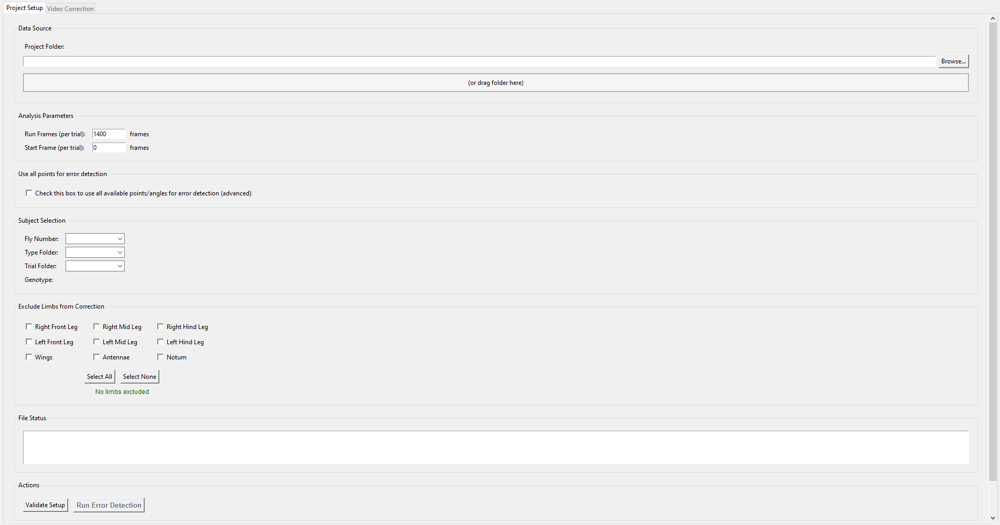
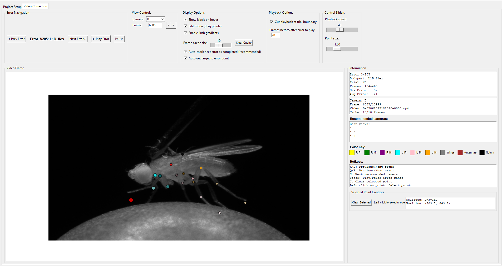

# Proofreading GUI

A GUI application built with Python's tkinter for proofreading and correcting DLC (DeepLabCut) assigned joint positions. The application provides an interface for correcting tracking errors in pose estimation data with built-in error detection algorithms and video playback capabilities.

## Table of Contents

- [Overview](#-overview)
- [Key Features](#-key-features)
- [Installation](#-installation)
- [File Structure](#-expected-file-structure)
- [Usage Guide](#-usage-guide)
  - [Keyboard Shortcuts](#5-keyboard-shortcuts)
- [Configuration](#-configuration)
- [Troubleshooting](#-troubleshooting)
- [Technical Details](#-technical-details)

## Overview

The Proofreading GUI is designed for researchers working with fly position data using DeepLabCut and Anipose. It provides:

- Pose correction with drag-and-drop
- Automated error detection using statistical analysis
- Multi-camera video playback synchronized with pose data

## Features

### Interface
- Drag-and-drop pose correction on video frames
- Multi-camera support for viewing different angles
- Real-time updates during corrections
- Keyboard shortcuts for navigation

### Error Detection
- Angle outlier detection using Savitzky-Golay filtering
- Length outlier detection using statistical analysis
- Batch processing of multiple error types

### Video Integration
- Frame caching for performance (5-20 frames configurable)
- Error range playback with configurable margins
- Adjustable playback speed
- Trial boundary respect option

### Data Management
- Multiple output formats (CSV and HDF5)
- Original data preservation (no modification to source files)

## Installation

### Method 1: Standalone Executable

1. Download the latest release from the [Releases](https://github.com/bidaye-lab/dlc_utilities/releases/tag/v1.0.0-beta) page
2. Extract the `release.zip` file
3. Run the `install.bat` script
4. Launch the application from the desktop shortcut

### Method 2: Python Environment

1. Clone the repository
   ```bash
   git clone -b proofreading-gui https://github.com/bidaye-lab/dlc_utilities/tree/proofreading_gui
   cd proofreading_gui
   ```

2. Create and activate virtual environment
   ```bash
   # Using venv (recommended)
   python -m venv .venv
   
   # Activate the environment
   .venv\Scripts\activate
   ```

3. Install dependencies
   ```bash
   pip install -r requirements.txt
   ```

4. Run the application
   ```bash
   python main.py
   ```

### Method 3: Build from Source

1. Follow Method 2 steps 1-3

2. Build the executable
   ```bash
   python compile_to_exe.py
   ```

3. Find the executable
   - Located in `dist/ProofreadingGUI.exe`

## Expected File Structure

The application can work with various folder structures and automatically detects different organizational patterns:

#### Pattern 1: Simple Structure
```
input-folder/
├── anipose/
│   ├── N1/
│   │   ├── pose-3d/
│   │   │   └── {genotype}N1.csv
│   │   └── angles/
│   │       └── {genotype}N1.csv
│   └── N2/
│       ├── pose-3d/
│       │   └── {genotype}N2.csv
│       └── angles/
│           └── {genotype}N2.csv
```

#### Pattern 2: With Type Folders
```
input-folder/
├── anipose/
│   ├── type1/
│   │   └── project/
│   │       ├── N1/
│   │       │   ├── pose-3d/
│   │       │   │   └── {genotype}N1.csv
│   │       │   └── angles/
│   │       │       └── {genotype}N1.csv
│   │       └── N2/
│   └── type2/
│       └── project/
│           ├── N1/
│           │   ├── pose-3d/
│           │   │   └── {genotype}N1.csv
│           │   └── angles/
│           │       └── {genotype}N1.csv
```

#### Pattern 3: With Trials
```
input-folder/
├── anipose/
│   ├── N1/
│   │   ├── trial1/
│   │   │   ├── pose-3d/
│   │   │   │   └── {genotype}N1.csv
│   │   │   └── angles/
│   │   │       └── {genotype}N1.csv
│   │   └── trial2/
│   │       ├── pose-3d/
│   │       │   └── {genotype}N1.csv
│   │       └── angles/
│   │           └── {genotype}N1.csv
```

#### Pattern 4: Complex Structure (Type + Trials)
```
input-folder/
├── anipose/
│   ├── type1/
│   │   └── project/
│   │       ├── N1/
│   │       │   ├── trial1/
│   │       │   │   ├── pose-3d/
│   │       │   │   │   └── {genotype}N1.csv
│   │       │   │   └── angles/
│   │       │   │       └── {genotype}N1.csv
│   │       │   └── trial2/
│   │       │       ├── pose-3d/
│   │       │       │   └── {genotype}N1.csv
│   │       │       └── angles/
│   │       │           └── {genotype}N1.csv
│   │       └── N2/
│   └── type2/
│       └── project/
│           └── N1/
│               └── trial1/
│                   ├── pose-3d/
│                   │   └── {genotype}N1.csv
│                   └── angles/
│                       └── {genotype}N1.csv
```

### Output Structure

The application creates output in two locations:

#### Error Reports and Logs
- Location: `input-folder/proofreader-output-{genotype}-N{number}/` (with type/trial subfolders if applicable)
- Files:
  - `bunched_outlier_errors.csv`: Detected errors with frame ranges and severity
  - `proofread_progress.csv`: Tracking of reviewed errors
  - `proofreader_log_{date}.log`: Application logs

#### Corrected Data
- Location: `input-folder/anipose/.../corrected-pose-2d/`
- Files:
  - `{genotype}-{camera}.h5`: HDF5 format with corrected pose data for each camera
  - `{genotype}-{camera}.csv`: CSV format with corrected pose data for each camera

### File Format Requirements

- `{genotype}N{number}.csv`: Joint angle data with columns for each joint (e.g., `L1D_flex`, `R1D_flex`)
- `{genotype}N{number}.csv`: 3D coordinate data with columns for each joint (e.g., `R-F-ThC_x`, `R-F-ThC_y`, `R-F-ThC_z`)
- Video files: MP4, AVI, or other OpenCV-compatible formats
- Camera naming: Videos should contain camera identifiers (i.e. the name must contain the camera letter)

## Usage

### 1. Launch the Application

Run `python main.py` or use the executable file.

### 2. Project Setup



1. Select Project Folder
   - Click "Browse..." to select your input folder
   - Or drag and drop the folder onto the interface

2. Configure Parameters
   - Run Frames: Number of frames per segment (default: 1400)
   - Start Frame: Initial offset for segments (default: 0)

3. Select Data
   - Choose the fly number from the dropdown
   - Select the type folder (if applicable)
   - Choose the trial folder (if multiple trials exist)

4. Configure Error Detection
   - Use all points: Check to use all available points/angles for error detection
   - Exclude limbs: Select specific limbs to exclude from error detection

### 3. Error Detection and Correction



1. Run Error Detection
   - Click "Run Error Detection" to start the process
   - The system analyzes angles and segment lengths for outliers

2. Navigate Errors
   - Use "Next Error" and "Previous Error" buttons
   - Or click directly on error entries in the list
   - Click on error number to edit and jump to specific error

3. Correct Poses
   - Click and drag joint positions on video frames
   - Click on empty space to move selected point
   - Changes are automatically saved to corrected-pose-2d directory

4. Video Playback
   - Use play/pause controls for video playback
   - "Play Error Range" plays through detected error frames
   - Navigate frame-by-frame using arrow keys or buttons

### 4. Advanced Features

#### Camera Selection
- Switch between cameras using the camera dropdown
- View multiple camera angles simultaneously
- Each camera shows the same frame with different perspectives
- Automatic camera recommendations based on error type

#### Limb Selection
- Select specific limbs for correction using checkboxes
- "Select All" and "Select None" for bulk operations

### 5. Keyboard Shortcuts

| Shortcut | Action |
|----------|--------|
| A | Previous Frame |
| D | Next Frame |
| Q | Previous Error |
| E | Next Error |
| Space | Play/Pause Error Range |
| S | Next Recommended Camera |
| C | Clear Selected Point |

#### Mouse Controls
- Left Click + Drag: Move joint positions on video frames
- Left Click on Point: Select a point for editing
- Left Click on Empty Space: Move selected point to new position
- Hover over Point: Show point label (if enabled)

## Configuration

### Error Detection Parameters

Modify `ErrorDetection.py` to customize:

```python
# Angle outlier detection
difference_threshold = 10.0  # Threshold for angle outliers
window_length = 24          # Savitzky-Golay filter window
polyorder = 8              # Polynomial order for smoothing

# Length outlier detection
length_pairs = [("TiTa", "TaG")]  # Segment pairs to analyze

# Default angle columns
angle_columns = [
    'L1D_flex', 'R1D_flex', 'L2D_flex', 'R2D_flex', 'L3D_flex', 'R3D_flex'
]
```

### Interface Settings

Modify `constants.py` for:
- Camera mappings
- Joint naming conventions
- Body part configurations

## Troubleshooting

### Common Issues

#### No data files found
- Cause: Incorrect file structure or missing files
- Solution: Verify the expected file structure and ensure all needed files exist

#### Video files not found
- Cause: Video files not in expected location or format
- Solution: Check video file paths and names as well as OpenCV-compatible formats

### Getting Help

1. Check log files in the output directory for detailed error information
2. Verify file formats match expected structure
3. Report bugs with log files

## Technical Details

### Error Detection Algorithm

The system uses two approaches for error detection:

1. Angle Outlier Detection:
   - Applies Savitzky-Golay filtering to smooth angle data
   - Calculates difference between raw and smoothed data
   - Identifies frames where difference exceeds threshold
   - Groups consecutive outliers into error bunches

2. Length Outlier Detection:
   - Calculates segment lengths from 3D coordinates
   - Computes mean and standard deviation for each segment
   - Identifies frames with z-scores above threshold
   - Analyzes configurable segment pairs (default: TiTa-TaG)

### Data Processing Pipeline

1. Data Loading: Read CSV files and validate structure
2. Error Detection: Apply statistical analysis to identify outliers
3. User Interface: Present errors with video context
4. Correction: Interactive pose adjustment with real-time feedback
5. Saving: Write corrected data to multiple formats
6. Logging: Record all operations for reproducibility